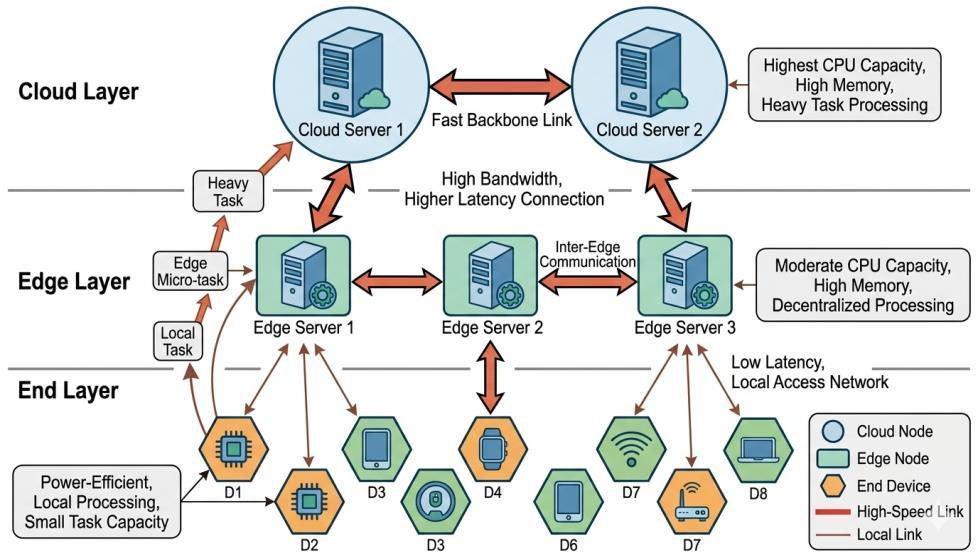
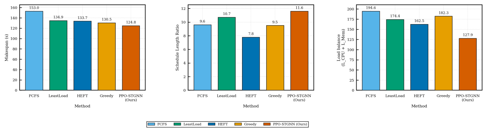
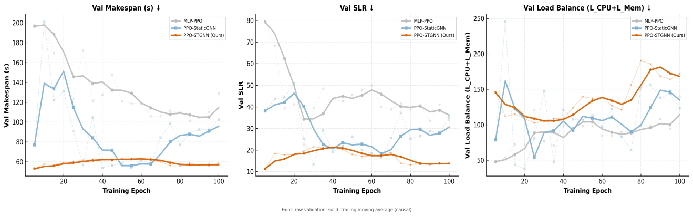

<div align="center">

# PPO-STGNN

### A Proximal Policy Optimization Approach with Spatio-Temporal Graph Neural Networks for DAG Task Scheduling in Cloud-Edge-End Computing

**Yangshuo Qi · Chenwei Wang · Zihan Shen · Songlin Sun**

**ICSINC 2026 · Accepted manuscript**

[](https://arxiv.org/abs/2609.03503)
[](https://github.com/Ailta666508/PPO-STGNN/actions/workflows/ci.yml)

[Paper](https://arxiv.org/abs/2609.03503) · [Overview](#overview) · [System Model](#system-model) · [Method](#method) · [Results](#experimental-results) · [Author Contributions](#author-contributions) · [Quick Start](#quick-start) · [Citation](#citation)

</div>

## Overview

Scheduling a workflow across cloud servers, edge nodes, and end devices requires decisions that account for both **task dependencies** and **changing resource availability**. A locally fast assignment can still create a downstream bottleneck or concentrate work on a small set of machines.

**PPO-STGNN** combines spatio-temporal graph representation learning with proximal policy optimization for heterogeneous DAG scheduling. The policy jointly reasons about the resource topology, the task graph, feasible task-node assignments, and multiple scheduling objectives; multi-teacher behavior cloning provides a stronger initialization than learning the joint action space from scratch.

| Topology-aware state | Constrained policy | Multi-objective learning |
| :--- | :--- | :--- |
| Encodes the physical resource graph and logical DAG dependencies. | Masks infeasible task-node assignments before PPO action selection. | Optimizes makespan, SLR, and CPU/memory load balance. |

> **Artifact scope.** The repository contains the paper-aligned source release, deterministic CPU checks, and engineering documentation. Processed workloads, checkpoints, and historical experiment logs are not redistributed. The figures below are the original figures from the [arXiv paper](https://arxiv.org/abs/2609.03503), not newly reproduced plots. See the [reproducibility notes](docs/REPRODUCIBILITY.md) for implementation and artifact boundaries.

## System Model

<p align="center">
  <a href="docs/assets/figure-1-system-model.jpg">
    
  </a>
</p>

<p align="center"><em>Figure 1. Cloud-edge-end hierarchical computing scenario with heterogeneous cloud, edge, and end resources.</em></p>

End devices generate DAG workflows, edge servers provide nearby moderate-capacity execution, and cloud servers supply high-capacity processing over higher-latency links. Scheduling decisions must respect task precedence, node capacity, and communication cost across this hierarchy.

## Method

<p align="center">
  <a href="docs/assets/figure-2-ppo-stgnn-framework.jpg">
    
  </a>
</p>

<p align="center"><em>Figure 2. Overall PPO-STGNN workflow: graph-based state encoding, PPO action selection, action refinement, environment execution, and multi-objective reward feedback.</em></p>

### Learning and scheduling pipeline

1. **State representation.** Build task-DAG and resource-graph observations from ready tasks, dependencies, node utilization, and resource history.
2. **Spatio-temporal encoding.** Produce node-level and graph-level embeddings that preserve structural and temporal context.
3. **Constrained joint action.** Select a ready task and execution node while masking infeasible assignments and refining the selected action.
4. **Multi-objective optimization.** Train the actor-critic policy with rewards derived from makespan, scheduling length ratio, and CPU/memory balance.
5. **Behavior-cloning initialization.** Pretrain from multiple heuristic teachers to reduce policy cold-start in the joint scheduling action space.

## Experimental Results

### Comparison with scheduling baselines

<p align="center">
  <a href="docs/assets/figure-3-baseline-comparison.png">
    
  </a>
</p>

<p align="center"><em>Figure 3. Comparison with FCFS, LeastLoad, HEFT, and Greedy on makespan, SLR, and load balance; lower is better for all three metrics.</em></p>

The paper reports the lowest makespan (**124.8 s**) and load-balance score (**127.9**) for PPO-STGNN. HEFT records the lowest SLR (**7.8**), making the trade-off visible rather than collapsing all objectives into a single ranking.

### Representation ablation

<p align="center">
  <a href="docs/assets/figure-4-encoder-comparison.png">
    
  </a>
</p>

<p align="center"><em>Figure 4. Validation trends for MLP-PPO, PPO-StaticGNN, and PPO-STGNN across makespan, SLR, and load balance.</em></p>

The comparison isolates the value of graph structure and temporal context: MLP-PPO omits topology, PPO-StaticGNN introduces structural information, and PPO-STGNN additionally models temporal resource dynamics. These are results reported in the paper; the public CI validates software behavior rather than reproducing the benchmark curves.

## Author Contributions

This was a collaborative research project, and all paper authors are credited above. **Zihan Shen** contributed to the scheduling system, objective design, policy initialization, and experimental evaluation, and maintains this public code release.

| Contribution area | Work completed | Repository entry points |
| :--- | :--- | :--- |
| Scheduling system | Developed task-dependency and heterogeneous-resource modeling for constrained DAG scheduling. | [Simulator](cecoppo/env_cec_dag.py), [graph encoders](cecoppo/graph_encoder.py), [PPO agent](cecoppo/ppo_agent.py) |
| Objective design | Formulated rewards for completion time, scheduling efficiency, CPU/memory balance, and utilization. | [Environment and rewards](cecoppo/env_cec_dag.py), [configuration](cecoppo/config.py) |
| Policy initialization | Applied multi-teacher behavior cloning to mitigate cold-start in the joint action space. | [Teacher collection and training](cecoppo/experiment_utils.py), [training entry point](train_ppo.py) |
| Experimental evaluation | Benchmarked against FCFS, LeastLoad, HEFT, and Greedy and compared policy encoders. | [Baseline policies](cecoppo/baselines.py), [baseline runner](run_baselines.py), [ablations](run_ablations.py) |

## Quick Start

### 1. Install

The release checks use **Python 3.12** and the dependency versions recorded in `requirements.txt`. This is a newly tested environment, not a claim about the original training environment.

```bash
git clone https://github.com/Ailta666508/PPO-STGNN.git
cd PPO-STGNN
python3.12 -m venv .venv
source .venv/bin/activate
python -m pip install -r requirements-dev.txt
```

For Windows, activate with `.venv\Scripts\Activate.ps1` in PowerShell. GPU training requires a compatible PyTorch/CUDA installation; the automated checks exercise CPU execution only.

### 2. Validate the release

```bash
python scripts/verify_source.py
python -m pytest -q
```

Without external data, the suite runs **14 deterministic tests** covering experiment-configuration snapshots, reproducible RNG and kernel configuration, objective normalization, action masking, small PPO updates, and checkpoint round trips across all three encoders. Five dataset-dependent checks are skipped. With a local dataset, the suite also checks DAG validity, split separation, and baseline environment interaction. Passing these checks validates software behavior; it does not reproduce the paper's benchmark results.

Release preparation also included **8 CPU tests with the local dataset** and a small end-to-end training/evaluation run on macOS arm64. See the [validation record](docs/release-validation.json) for the tested versions and scope. [GitHub Actions](.github/workflows/ci.yml) checks source integrity and the data-free CPU suite on every push and pull request.

### 3. Run a small training experiment

Training requires a separately obtained copy of the processed workload; no public download is provided in this release. If you have authorized access, place it in `./new500DAG` or pass its location with `--data-dir`. See [Data Access](docs/DATA_AND_IMPLEMENTATION.md#data-access).

```bash
python train_ppo.py \
  --data-dir ./new500DAG \
  --project-root ./runs/quick \
  --quick --device cpu --seed 42
```

`--quick` reduces the workload and training budget for a functional check. It is not a paper evaluation setting. New outputs go to `runs/quick/`. For baseline evaluation, full training, and controlled architecture comparisons, see [Experiments](docs/EXPERIMENTS.md).

## Repository Guide

```text
cecoppo/
  env_cec_dag.py       # Cloud-edge-end simulator, observations, masks, rewards
  graph_encoder.py     # Temporal graph, static graph, and MLP actor-critic models
  ppo_agent.py         # Rollouts, GAE, clipped PPO updates, checkpoint I/O
  baselines.py         # Non-learning scheduling policies
  experiment_utils.py # Behavior cloning, training, evaluation, plotting helpers
  config.py           # Environment and PPO configuration dataclasses
  config_io.py        # Validated configuration snapshots and fingerprints
train_ppo.py           # Main policy training and evaluation entry point
export_experiment_config.py # Persist a resolved configuration before a run
run_baselines.py       # FCFS / LeastLoad / HEFT / Greedy experiments
run_ablations.py       # Architecture comparisons and component ablations
plot_results.py        # Plotting entry point
docs/                  # Paper, provenance, implementation and run notes
tests/                 # Deterministic CPU software checks
scripts/               # Source and paper-asset integrity verification
```

The locally supplied workload contains **500 DAGs** split into **398 training / 48 validation / 54 test** workflows. Its resource pool contains **90 nodes**; the default experiment configuration selects **38**. The processed dataset and the simulator's runtime configuration are distinct. See [Data and Implementation](docs/DATA_AND_IMPLEMENTATION.md).

## Reproducibility

- [Reproducibility notes](docs/REPRODUCIBILITY.md) separate paper claims, released code, and historical local artifacts.
- [Experiment guide](docs/EXPERIMENTS.md) documents baseline, training, and ablation entry points.
- [Data and implementation](docs/DATA_AND_IMPLEMENTATION.md) records workload access and simulator assumptions.
- [Release validation](docs/release-validation.json) records the tested environment and verification scope.

## Citation

```bibtex
@misc{qi2026ppostgnn,
  title         = {PPO-STGNN: A Proximal Policy Optimization Approach with
                   Spatio-Temporal Graph Neural Networks for DAG Task Scheduling
                   in Cloud-Edge-End Computing},
  author        = {Qi, Yangshuo and Wang, Chenwei and Shen, Zihan and Sun, Songlin},
  year          = {2026},
  eprint        = {2609.03503},
  archivePrefix = {arXiv},
  primaryClass  = {cs.AI},
  url           = {https://arxiv.org/abs/2609.03503},
  note          = {Accepted at ICSINC 2026}
}
```

## Reuse and Contact

No repository-wide license was included with the supplied package. This release does not assign a new license to the paper, code, or processed data. Please contact the authors about reuse and redistribution, and check the rights of any upstream data separately.

For questions about this release or to report a reproducibility issue, please [open an issue](https://github.com/Ailta666508/PPO-STGNN/issues).

**Note:** This project was initially developed locally. The Git repository was created when the codebase was prepared for publication, so the early development history is unavailable. Subsequent updates are tracked in this repository.
