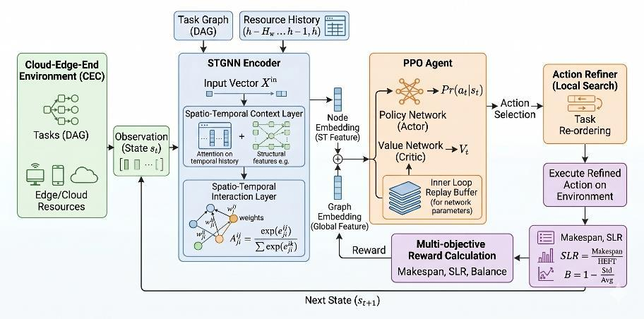

<div align="center">

# PPO-STGNN

### A Proximal Policy Optimization Approach with Spatio-Temporal Graph Neural Networks for DAG Task Scheduling in Cloud-Edge-End Computing

**Yangshuo Qi · Chenwei Wang · Zihan Shen · Songlin Sun**

**ICSINC 2026 · Accepted manuscript**

[](https://github.com/Ailta666508/PPO-STGNN/actions/workflows/ci.yml)

[Download Paper (PDF)](https://raw.githubusercontent.com/Ailta666508/PPO-STGNN/main/docs/paper.pdf) · [My Contributions](#contributions-by-zihan-shen) · [Quick Start](#quick-start) · [Reproducibility](docs/REPRODUCIBILITY.md) · [Citation](#citation)

</div>

## Overview

Scheduling a workflow across cloud servers, edge nodes, and end devices requires decisions that account for both **task dependencies** and **changing resource availability**. A locally fast assignment can still create a downstream bottleneck or concentrate work on a small set of machines.

PPO-STGNN studies this problem through graph representation learning and reinforcement learning. It combines resource and task representations, a constrained task–node action space, and multi-objective rewards, with heuristic behavior cloning to initialize a PPO scheduling policy.

<p align="center">
  
  <br>
  <em>Framework reproduced from the supplied manuscript. See the implementation notes below for differences in this code release.</em>
</p>

### Research highlights

- **Resource and workflow modeling.** Jointly represent heterogeneous computing resources and DAG dependencies to inform scheduling decisions.
- **Constrained joint actions.** Select a ready task and an execution node while masking infeasible assignments according to resource and topology constraints.
- **Multiple scheduling objectives.** Account for completion time, scheduling length ratio (SLR), and CPU/memory load balance, rather than optimizing a single local execution cost.
- **Heuristic initialization.** Use demonstrations from scheduling heuristics for behavior cloning before PPO optimization, addressing the difficulty of learning in a large action space from scratch.
- **Comparative evaluation.** Include FCFS, LeastLoad, HEFT, and Greedy baselines, together with MLP, static graph, and temporal graph policy variants.

> **Release scope.** This repository publishes the paper, research source, and documentation. Processed data, historical experiment logs, and model weights are not redistributed. It is not a verified reproduction of every manuscript result: the code uses temporal attention where the manuscript describes a GRU, and the locally supplied PPO summaries do not match Table 1. [Reproducibility notes](docs/REPRODUCIBILITY.md) document these differences explicitly.

## Contributions by Zihan Shen

This was a collaborative research project. My contributions focused on the scheduling framework, reward formulation, heuristic pretraining, and experimental evaluation. The complete paper author list is retained above and in the citation.

| Area | My contribution | Relevant implementation |
| :--- | :--- | :--- |
| Scheduling framework | Developed the PPO-STGNN scheduling framework to model task dependencies, resource states, and heterogeneous computing constraints. | [Simulator](cecoppo/env_cec_dag.py), [graph encoders](cecoppo/graph_encoder.py), [PPO agent](cecoppo/ppo_agent.py) |
| Reward formulation | Formulated multi-objective rewards for completion time, scheduling efficiency, CPU/memory balance, and resource utilization. | [Environment and rewards](cecoppo/env_cec_dag.py), [configuration](cecoppo/config.py) |
| Behavior cloning | Applied heuristic behavior cloning pretraining to mitigate policy cold-start in the joint scheduling action space. | [Teacher collection and training](cecoppo/experiment_utils.py), [training entry point](train_ppo.py) |
| Benchmarking | Evaluated the approach against FCFS, LeastLoad, HEFT, and Greedy in scheduling and resource allocation experiments. | [Baseline policies](cecoppo/baselines.py), [baseline runner](run_baselines.py), [experiment variants](run_ablations.py) |

These links locate the relevant functionality; they do not imply exclusive authorship of every linked file. The contribution summary describes my role in the project, while the reproducibility notes describe what can currently be established from this release.

## Results Reported in the Paper

The following values are transcribed from **Table 1 of the manuscript**. Lower is better for all three metrics. These are reported paper results, not measurements newly reproduced from this repository.

| Method | Makespan ↓ | SLR ↓ | Load balance ↓ |
| :--- | ---: | ---: | ---: |
| FCFS | 153.0 | 9.6 | 194.6 |
| LeastLoad | 134.9 | 10.7 | 174.4 |
| HEFT | 133.7 | **7.8** | 162.5 |
| Greedy | 130.5 | 9.5 | 182.3 |
| **PPO-STGNN** | **124.8** | 11.6 | **127.9** |

Relative to HEFT, the reported PPO-STGNN result reduces makespan by approximately **6.7%** and the load balance metric by **21.3%**. The tradeoff is a higher SLR: **HEFT performs best on SLR** in this table. No claim of statistical significance is made from these aggregate values.

The locally supplied baseline CSV agrees with the rounded baseline rows above. The locally supplied PPO CSVs contain different values; see the [result crosswalk](docs/REPRODUCIBILITY.md#paper-and-artifact-results). Those historical CSV files are not part of the public repository.

## Quick Start

### 1. Install

The release checks use **Python 3.12** and the dependency versions recorded in `requirements.txt`. This is a newly tested environment, not a claim about the original training environment.

```bash
git clone https://github.com/Ailta666508/PPO-STGNN.git
cd PPO-STGNN
python3.12 -m venv .venv
source .venv/bin/activate
python -m pip install -r requirements-dev.txt
```

For Windows, activate with `.venv\Scripts\Activate.ps1` in PowerShell. GPU training requires a compatible PyTorch/CUDA installation; the automated checks exercise CPU execution only.

### 2. Validate the release

```bash
python scripts/verify_source.py
python -m pytest -q
```

Without external data, the suite runs six synthetic-observation tests for model action masking, a small PPO update, and checkpoint round trips across all three encoders, plus four unit tests for deterministic seeding and multi-objective reward helpers. It explicitly skips five data-dependent checks. With a local dataset, it also checks DAG validity, split separation, and baseline environment interaction. **Passing these checks does not reproduce the paper's benchmark results.**

Release preparation included **8 CPU tests with the local dataset** and a small end-to-end training/evaluation run on macOS arm64. See the [validation record](docs/release-validation.json) for the tested versions and scope. [GitHub Actions](.github/workflows/ci.yml) now checks source integrity and the data-free CPU smoke suite on every push and pull request.

### 3. Run a small training experiment

Training requires a separately obtained copy of the processed workload; no public download is provided in this release. If you have authorized access, place it in `./new500DAG` or pass its location with `--data-dir`. See [Data Access](docs/DATA_AND_IMPLEMENTATION.md#data-access).

From the repository root, after providing the dataset:

```bash
python train_ppo.py \
  --data-dir ./new500DAG \
  --project-root ./runs/quick \
  --quick --device cpu --seed 42
```

`--quick` reduces the workload and training budget for a functional check. It is not a paper evaluation setting. New outputs go to `runs/quick/`. Data, logs, and weights are excluded from Git by default. For baseline evaluation, full training, and controlled architecture comparisons, see [Experiments](docs/EXPERIMENTS.md).

## Repository Guide

```text
cecoppo/
  env_cec_dag.py       # Cloud–edge–end simulator, observations, masks, rewards
  graph_encoder.py     # Temporal graph, static graph, and MLP actor–critic models
  ppo_agent.py         # Rollouts, GAE, clipped PPO updates, checkpoint I/O
  baselines.py         # Non-learning scheduling policies
  experiment_utils.py # Behavior cloning, training, evaluation, plotting helpers
  config.py           # Environment and PPO configuration dataclasses
  config_io.py        # Validated configuration snapshots and fingerprints
train_ppo.py           # Main policy training and evaluation entry point
export_experiment_config.py # Persist a resolved configuration before a run
run_baselines.py       # FCFS / LeastLoad / HEFT / Greedy experiments
run_ablations.py       # Architecture comparisons and component ablations
plot_results.py        # Plotting entry point
docs/                  # Manuscript, provenance, implementation and run notes
tests/                 # Small CPU software checks added for this release
scripts/               # Source-integrity verification
```

The locally supplied workload contains **500 DAGs** split into **398 training / 48 validation / 54 test** workflows. Its resource pool contains **90 nodes**; the default experiment configuration selects **38**. The processed dataset and the simulator's runtime configuration are distinct. See [Data and Implementation](docs/DATA_AND_IMPLEMENTATION.md).

## Code Release

The public release preserves the supplied Python implementation. Data, checkpoints, and result files remain local and are not included in public Git history. New English documentation, dependency specifications, software checks, and a CI template make the code easier to inspect and run. A [SHA-256 manifest](docs/source-manifest.json) records the 15 original source/documentation files included here; the [original README](docs/original-source-readme.md) is retained verbatim as an archive and refers to the larger local package.

## Citation

Please credit all paper authors when referring to this work. The supplied PDF is an accepted manuscript; no DOI or final proceedings pagination is asserted here.

```bibtex
@misc{qi2026ppostgnn,
  title  = {PPO-STGNN: A Proximal Policy Optimization Approach with
            Spatio-Temporal Graph Neural Networks for DAG Task Scheduling
            in Cloud-Edge-End Computing},
  author = {Qi, Yangshuo and Wang, Chenwei and Shen, Zihan and Sun, Songlin},
  year   = {2026},
  note   = {Accepted at ICSINC 2026},
  url    = {https://github.com/Ailta666508/PPO-STGNN}
}
```

## Reuse and Contact

No repository-wide license was included with the supplied package. This release does not assign a new license to the paper, code, or processed data. Please contact the authors about reuse and redistribution, and check the rights of any upstream data separately.

For questions about this release or to report a reproducibility issue, please [open an issue](https://github.com/Ailta666508/PPO-STGNN/issues).

**Note:** This project was initially developed locally. The Git repository was created when the codebase was prepared for publication, so the early development history is unavailable. Subsequent updates are tracked in this repository.
